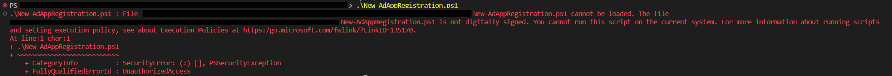
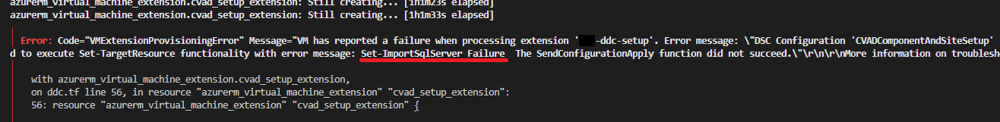
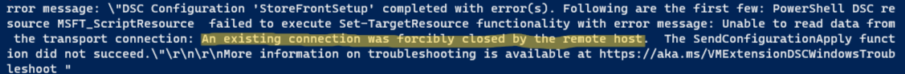
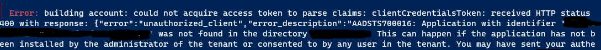

# User Manual for Site Deployment Module for Citrix® Virtual Apps and Desktops

## Table of Contents
  - [Scope](#scope)
  - [Dependencies](#dependencies)
  - [Preparation](#preparation)
  - [Create Azure Application Registration by Script](#create-azure-application-registration-by-script)
    - [1. Before Executing Active Directory App Registration Script](#1-before-executing-active-directory-app-registration-script)
    - [2. Install Az Module with Active Directory App Registration Script](#2-install-az-module-with-active-directory-app-registration-script)
    - [3. Executing Active Directory App Registration Script](#3-executing-active-directory-app-registration-script)
  - [Create Azure Application Registration Manually](#create-azure-application-registration-manually)
  - [Required Inputs](#required-inputs)
  - [Steps to Execute](#steps-to-execute)
    - [1. Requirements:](#1-requirements)
    - [2. Before Starting Deployment with New-CvadDeployment Script](#2-before-starting-deployment-with-new-cvaddeployment-script)
    - [3. Steps to Start Deployment](#3-steps-to-start-deployment)
  - [Launch Session](#launch-session)
    - [Accessing StoreFront with DDC Private IP Address within VNet](#accessing-storefront-with-ddc-private-ip-address-within-vnet)
  - [Debugging](#debugging)
    - [During execution of PowerShell scripts](#during-execution-of-powershell-scripts)
    - [During execution of `New-CvadDeployment.ps1` script](#during-execution-of-new-cvaddeploymentps1-script)
      - [Terraform:](#terraform)
      - [Desired State Configuration (DSC):](#desired-state-configuration-dsc)
  - [Common Errors And Resolution](#common-errors-and-resolution)
  - [Clean Up and Retry](#clean-up-and-retry)
    - [Cleanup faulty resource(s) and Retry](#cleanup-faulty-resources-and-retry)
    - [Complete Cleanup](#complete-cleanup)

## Scope
The scope of this project is to:
1. Create Azure Virtual Machines with using Terraform for CVAD installation
      <table>
        <tr>
          <th>Virtual Machine Name</th>
          <th>Component Name</th>
        </tr>
        <tr>
          <td>Desktop Delivery Controller (DDC) Virtual Machine or Standalone VM</td>
          <td>
              Controller
              <br />
              Director
              <br />
              StoreFront
              <br />
              Desktop Studio
              <br />
              WebStudio
              <br />
              MS SQL Database Server
              <br />
              License Server
          </td>
        </tr>
        <tr>
          <td>Active Directory Virtual Machine</td>
          <td>Active Directory Domain Controller</td>
        </tr>
      </table>

2. Install and Configure CVAD Components for a functional Site setup
3. Creation of Machine Catalog and Delivery Groups for Session Launch

## Dependencies
1. The customer needs to have access to an azure subscription in which all the resources will get created

2. For all the commands mentioned in this guide, please run them in PowerShell (v5.1 or higher) with `Administrator` privilege.

3. The customer's Azure subscription contains an App Registration with `Contributor` access. This app registration will be used by terraform to create the Azure resources. If the subscription does not contain an existing app registration, the customer should have permission in the subscription to create one and grant it the `Contributor` role. You may create a new application registration by referring to the section [Create Azure Application Registration by Script](#create-azure-application-registration-by-script)

## Preparation

Please make a copy of the `azure.tfvars.json.example` and the `inputs.tfvars.json.example` files under the package root directory. Then rename the new files to `azure.tfvars.json` and `inputs.tfvars.json` respectively

## Create Azure Application Registration by Script

### 1. Before Executing Active Directory App Registration Script
- Before executing the `New-ActiveDirectoryAppRegistration.ps1` script, please execute the following command in PowerShell to make sure the script will not be blocked:
  > `Set-ExecutionPolicy -Scope Process -ExecutionPolicy Bypass -Force`
- Please verify that the customer's Azure account to be used should have the privilege to assign `Contributor` access to an App Registration in the intended Azure subscription
- The customer needs to have `Az` PowerShell module with version `9.0.0` or higher installed. 
   - You may check the existence of required `Az` PowerShell module version with following command:
      > `Get-InstalledModule Az -MinimumVersion 9.0.0`
   - If the `Az` PowerShell module has not been installed, you may install `Az` module using either of the following two methods:
     - Install with `New-ActiveDirectoryAppRegistration.ps1` script during setup process: please refer to section [Install Az Module with Active Directory App Registration Script](#install-az-module-with-ad-app-registration-script)
     - Manual installation: You may follow this guide to complete installation: [Link to Guide](https://learn.microsoft.com/en-us/powershell/azure/install-azure-powershell)


- The customer needs to make sure `AzureRM` PowerShell module is removed from their environment. After the installation of `Az` PowerShell module in the previous step, you may run the following command to uninstall `AzureRM` PowerShell module.
    > `Uninstall-AzureRM`

### 2. Install Az Module with Active Directory App Registration Script

When running the `New-ActiveDirectoryAppRegistration.ps1` script in the next step below, you may add an optional parameter `-IncludeAzModule` to install the dependency of this script.

### 3. Executing Active Directory App Registration Script

To create an app registration, you can find the `New-ActiveDirectoryAppRegistration.ps1` powershell script in the package root directory. The script can be run in 2 ways, as mentioned below. The script will first prompt you to enter your Azure subscription ID, following which you will be prompted to enter your Azure username and password. 

You may run the `New-ActiveDirectoryAppRegistration.ps1` script by executing the command below with the following optional parameters 
   - `AzureTenantId`: Specify the Tenant ID for you Azure Account
   - `AzureApplicationName`: override the default "application display name
   - `IncludeAzModule`: Install the dependency of the New-ActiveDirectoryAppRegistration script

  > `.\New-ActiveDirectoryAppRegistration.ps1 -AzureSubscriptionId "YourSubscriptionId" [-AzureTenantId <Your Azure Subscription Tenant Id>] [-AzureApplicationName "YourApplicationName"] [-IncludeAzModule]`


## Create Azure Application Registration Manually

The values for the variables used by the terraform code are defined in the `azure.tfvars.json` located under the package root directory along with the `inputs.tfvars.json` file under the same directory.

> Customers can modify any of the values present in these `tfvars.json` files. The description for each of these variables can be found in the `variables.tf` file located under `/terraform/` directory.

The values for the following variables are **missing** and **need to be provided by the customer**:

1. Under `azure.tfvars.json` file:
   > If you run the `New-ActiveDirectoryAppRegistration.ps1` script to create a new app registration, all the values in the file `azure.tfvars.json` will automatically get populated by the script. However, if you are not running the script and are planning to use an existing app registration, then you will have to manually update the values, the details about which are mentioned below.

   - **azure_client_secret**: Client Secret of the App Registration created under the Dependencies section
       - This secret is used by `Terraform` for connecting to Azure and provision Azure resources. 
       - This secret is also used by Citrix `Machine Creation Service (MCS)` for connecting to Azure to provision `Virtual Delivery Agent (VDA)`. 
       - This is a secret of Azure AD Application specified by `azure_client_id`.
   - **azure_subscription_id**: Subscription ID of the customer's azure account in which the resources will be created 
   - **azure_client_id**: Client ID of the App Registration created under the Dependencies section
   - **azure_tenant_id**: Tenant ID of the customer's azure account in which the resources will be created


## Required Inputs
Under `inputs.tfvars.json` file
   - **license_file_path**: Full path of the customer's License file. This is not mandatory if you are using CVAD installer version 2308 or newer.
   > Please make sure that the hostname specified in the CVAD license file matches the variable `ddc_machine_name` in the `input.tfvars.json` file
   - **vda_image_source_link**: URL to the VDA Image that will be used in deployment
   - **vda_hyper_v_generation**: Corresponding Hyper-V generation for VDA machine image, it can be either `V1` or `V2`
   - **cvad_installer_iso_file_path**: Either a local path or an URL to the CVAD installer ISO file
   - **is_cvad_installer_stored_locally**: Specifying if the CVAD installer ISO file is stored in a locally directory. If it is set to `false`, user needs to provide a URL to the CVAD installer file, along with the proper MD5 value for the installer file for input variable `cvad_installer_iso_file_md5`


## Steps to Execute

### 1. Requirements:

-  The customer needs to make sure `Terraform` with version `1.4.0` or higher is installed in their environment. This can be checked with command:
    > `terraform -version`
  
     - If `Terraform` has not been installed, you may follow the two methods below to install `Terraform` as a requirement:
       1. **Manually install:** you may follow this guide for manual installation process [Link to Guide](https://developer.hashicorp.com/terraform/tutorials/aws-get-started/install-cli)
       2. **Using the `New-CvadDeployment.ps1` script to install terraform during deployment:** you may add argument `-IncludeTerraform` to let `New-CvadDeployment.ps1` install the `Terraform` dependencies for you.
  
### 2. Before Starting Deployment with New-CvadDeployment Script

   
1. If you don't need to review and confirm the terraform action plan so that you wish to apply the changes directly, you may add the optional `-AutoApprove` flag when running `New-CvadDeployment.ps1`.

2. If you wish to show the session launch password from the deployment summary, you may add the optional `-ShowSessionLaunchPassword` flag when running `New-CvadDeployment.ps1`.

3. If you wish to let terraform generate a JSON output file as a machine readable deployment summary, you may add the optional `-OutputJsonDeploymentSummary` when running `New-CvadDeployment.ps1`.

4. If you wish to override the default `parallelism` value for Terraform, you may add the optional `-Parallelism` parameter.
   - The default value for `Parallelism` is `2`
   - If the value is too high, the cloud provider could report too many request error that interrupt the site deployment

5. You may also add the `-PreserveAzureCredential` flag to save Azure credential in `azure.tfvars.json` file, if this flag is not specified, the Azure credential will be removed once the deployment completed.

### 3. Steps to Start Deployment

To execute the terraform code, open a powershell window in Administrator mode. Run the `New-CvadDeployment.ps1` script by executing the following command:

> `.\New-CvadDeployment.ps1 [-AutoApprove] [-IncludeTerraform] [-ShowSessionLaunchPassword] [-OutputJsonDeploymentSummary] [-Parallelism <Your Parallelism Override Value>] [-PreserveAzureCredential]`

## Launch Session

### Accessing StoreFront with DDC Private IP Address within VNet

1. After the execution of `New-CvadDeployment.ps1` script, it will print out 3 sets of credentials:
   - Credential for using remote desktop logging into the Active Directory Domain Controller virtual machine
   - Credential for logging into the Store Front after signing into the Active Directory Domain Controller virtual machine
   - Credential for logging into the Web Studio after signing into the Active Directory Domain Controller virtual machine

2. You can open any remote desktop tool, use the credential for remote desktop in step 1 to log into the virtual machine.

3. Next, you can access the `Store Front` with Store Front credential in step 1 within the virtual machine. You may launch a session using the Store Front page.

## Deployment Removal
1. Make sure you are using the same environment that used for the deployment
2. Please open a PowerShell session with **Administrator privilege**
3. Please run the following command in the PowerShell session to set the execution policy

> `Set-ExecutionPolicy -Scope Process -ExecutionPolicy Bypass -Force`   

1. Run the `Remove-CvadDeployment.ps1` script for resource deletion. The optional `AutoApprove` flag can be added for skipping Terraform plan verification

> `./Remove-CvadDeployment.ps1 [-AutoApprove]`


## Debugging

### During execution of PowerShell scripts

You might encounter the following errors:

1. PowerShell indicating the script is not `digitally signed`, which blocks the script from running on your system
   - Example:
    
   - You may use the following command to unblock the script execution in current PowerShell session:
        > `Set-ExecutionPolicy -Scope Process -ExecutionPolicy Bypass -Force`

### During execution of `New-CvadDeployment.ps1` script

When executing the `New-CvadDeployment.ps1` script, errors might occur during the creation of resources (terraform errors) or during the configuration of these resources (errors caused by DSC or Custom script extension).
Following are a few ways to determine the cause of error or the step at which the error occured:

#### **Terraform:**

These errors will be displayed on the console used to execute the `New-CvadDeployment.ps1` script. The debug logs for terraform are located in the `./terraform.log` file.

#### **Desired State Configuration (DSC):**

A brief error message will be displayed on the console used to execute the `New-CvadDeployment.ps1` script. This error message will highlight the Virtual Machine being configured when the error occurred.

More details about the exception can be found by following the steps below:

1. Open the Azure portal > navigate to the Virtual Machine being configured > click on Extensions + applications > Click on the extension with the type `Microsoft.Powershell.DSC` > Click on `View detailed status`. The `message` field will contain details about the DSC code block which resulted in an exception.

2. Use Remote Desktop Protocol (RDP) to access the Virtual Machine. Open `Event Viewer` by searching for it in the Start Menu. Navigate to `Event Viewer > Applications and Services Logs > Microsoft > Windows > Desired State Configuration > Operational`. Here, you can find all the errors that occurred while the DSC script was executing.

3. If the error occurs in the DDC VM, there are additional logs available under the path pointed to by the `citrix_modules_path` variable in `values.tfvars`. By default, this path is set to `C:\CitrixModules`. The logs are located in the file `CVAD_Installation.log`.

4. For any Virtual Machine provisioned following this guide, there are additional logs available under path `C:\WindowsAzure\Logs\Plugins\Microsoft.Powershell.DSC\2.77.0.0\`. These logs are generated by Azure DSC script extension during DSC resource provision.

## Common Errors And Resolution

1. Retryable Error (429)
   - Example:
    > ```
    > azurerm_virtual_network.vnet: network.VirtualNetworksClient#CreateOrUpdate:
    > Failure responding to request: StatusCode=429
    > Original Error: autorest/azure: Service returned an error. Status=429 Code="RetryableError" 
    > Details=...
    > ```
   - This error occurs when terraform exits prematurely while the request is still being retried by Azure.
   - To resolve this issue, you may refer to [Clean Up and Retry](#clean-up-and-retry) section. Either `Cleanup faulty resource(s) and Retry` or `Complete Cleanup` would fix the error in this scenario.

2. Desired State Configuration script extension failed due to `SqlServer` PowerShell module installation issue
    - Example:
    
    - This is a failure of PowerShell `Install-Module` command failling to install the requried `SqlServer` PowerShell module. 
    - To resolve this issue, you may refer to [Clean Up and Retry](#clean-up-and-retry) section. Either `Cleanup faulty resource(s) and Retry` or `Complete Cleanup` would fix the error in this scenario.

3. Virtual Machine DSC Extension provision Failure
   - Example: 
    > ```
    > Error: Code="VMExtensionProvisioningError" 
    > Message="VM has reported a failure when processing extension '...'. 
    > Error message: \"DSC Configuration '...' completed with error(s). Following are the first few: PowerShell DSC resource MSFT_ScriptResource  failed to execute Test-TargetResource functionality
    > ```
   - This is a failure of `Desired State Configuration Extension` provision on Azure Virtual Machine.
   - To resolve this issue, you may refer to [Clean Up and Retry](#clean-up-and-retry) section. Either `Cleanup faulty resource(s) and Retry` or `Complete Cleanup` would fix the error in this scenario.

4. Virtual Machine Custom Script Extension provision Failure
   - Example: 
	> ```
    > Error: Code="VMExtensionProvisioningError" 
	> Message="VM has reported a failure when processing extension 'CustomScriptExtension'. "
    > Error Message="Command execution finished, but failed because it returned a non-zero exit code of: '1'."
    > ```
   - This is a failure of `Custom Script Extension` provision on Azure Virtual Machine.
   - To resolve this issue, you may refer to [Clean Up and Retry](#clean-up-and-retry) section. Either `Cleanup faulty resource(s) and Retry` or `Complete Cleanup` would fix the error in this scenario.

5. Forcibly Closed Failure
    - Example:
    
    - This is a failure caused by logging in VM with AD admin credential before the setup is completed
    - To resolve this issue, you may refer to [Clean Up and Retry](#clean-up-and-retry) section. Either `Cleanup faulty resource(s) and Retry` or `Complete Cleanup` would fix the error in this scenario.
  
6. Application Not Found Failure
    - Example:
    
    - This is a failure from the app registration not ready after user run the `New-ActiveDirectoryAppRegistration.ps1` script
    - To resolve this issue, you may wait a few seconds and refer to [Clean Up and Retry](#clean-up-and-retry) section. Either `Cleanup faulty resource(s) and Retry` or `Complete Cleanup` would fix the error in this scenario.

## Clean Up and Retry

### Cleanup faulty resource(s) and Retry

1. Identify the resource in which the error happened
     - If the error occurred in `DSC extension` or `Custom Script Extension`: please navigate to `Azure Portal` >  Navigate to the Virtual Machine with the failed DSC/Custom Script extension > Click on `Extensions + applications` > Click on the extension with the type `Microsoft.Powershell.DSC` (DSC) or `Microsoft.Compute.CustomScriptExtension` (Custom Script Extension) > Click on `Uninstall`.
     - If the error occurred on any Azure resources, such as virtual machines: please navigate to Azure Portal and manually find and delete the failed resource(s)
2. After ensuring all faulty resources are deleted on Azure, you may navigate to package root directory and run `New-CvadDeployment.ps1` script again

### Complete Cleanup

**IMPORTANT**: This method will delete <span style="color:red">**ALL**</span> resources within resource groups defined by `cvad_component_resource_group_name` and `vda_resource_group_name`. This is an <span style="color:red">**IRREVERSIBLE**</span> action

1. Navigate to package root directory and run the following command to delete all resources created by terraform:
    > `./Remove-CvadDeployment.ps1`
2. Navigate to Azure Portal, ensure that the resource groups with names specified by terraform variables `cvad_component_resource_group_name` and `vda_resource_group_name` are deleted from your subscription
3. Now, you may may navigate to package root directory and run `New-CvadDeployment.ps1` script again by following the steps mentioned under the section [Steps to Execute](#steps-to-execute).
